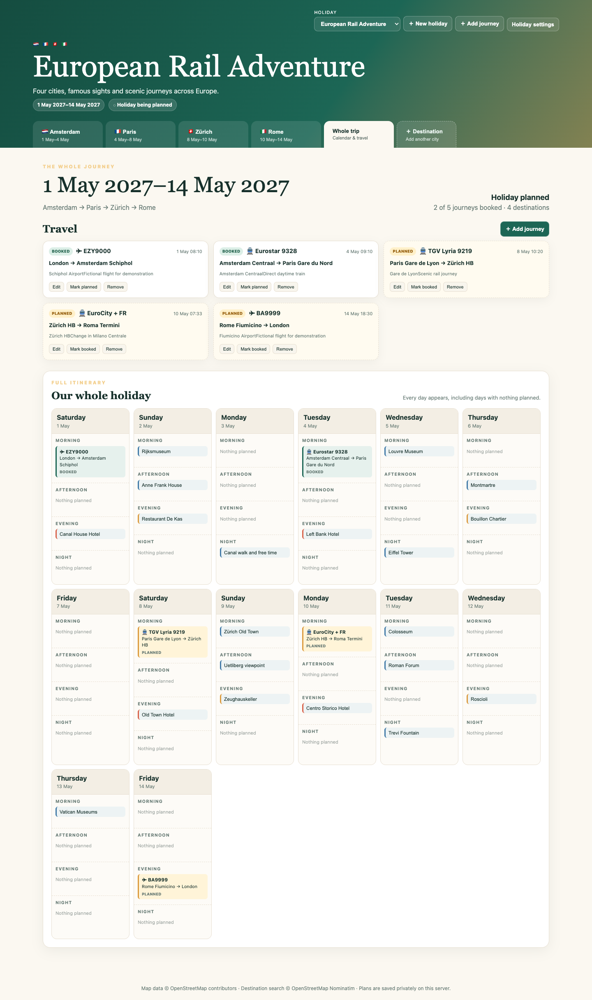

# Holiday Planner

A lightweight, self-hosted web app for planning single- or multi-destination holidays. It combines maps, places, flexible day planning and travel bookings in one responsive interface.



## Features

- Any number of holidays and destinations
- Automatic destination maps and country flags
- Hotels, restaurants, bars, sights and free-text ideas
- Editable destination information cards for visas, health notes, useful phrases and links
- Morning, afternoon, evening and night scheduling
- Whole-trip calendar with every day shown
- Whole-trip packing and to-do checklists
- Flights, trains, ferries, coaches, cars, taxis and custom journeys
- Planned/booked status for holidays and journeys
- City, beach, wildlife, winter, road-trip and colour themes
- Automatic previous-holiday grouping
- SQLite storage and cached OpenStreetMap tiles
- No third-party Python packages required

## Quick start

Requires Python 3.9 or newer.

```bash
git clone https://github.com/ChimeraX-CMRX/holiday-planner.git
cd holiday-planner
HOLIDAY_HOST=127.0.0.1 HOLIDAY_PORT=7070 python3 server.py
```

Open `http://127.0.0.1:7070`.

The database and tile cache are created on first run. They are deliberately excluded from Git.

## Configuration

All runtime settings are optional environment variables:

| Variable | Default | Purpose |
|---|---|---|
| `HOLIDAY_HOST` | `0.0.0.0` | Listen address. Use `127.0.0.1` behind a reverse proxy. |
| `HOLIDAY_PORT` | `7070` | Listen port. Choose any unused port. |
| `HOLIDAY_DB_PATH` | `./holiday-planner.sqlite3` | SQLite database location. |
| `HOLIDAY_TILE_CACHE` | `./tile-cache` | Map tile cache location. |

Example on a LAN:

```bash
HOLIDAY_HOST=0.0.0.0 \
HOLIDAY_PORT=8085 \
HOLIDAY_DB_PATH=/srv/holiday-planner/data/planner.sqlite3 \
HOLIDAY_TILE_CACHE=/srv/holiday-planner/data/tiles \
python3 server.py
```

Other devices would then visit `http://SERVER_IP:8085`. Allow the chosen port through the host firewall if required. Do not expose the app directly to the public Internet without authentication and a properly configured reverse proxy.

## systemd installation

1. Copy the repository to `/opt/holiday-planner`.
2. Create a dedicated unprivileged user, for example `website`.
3. Create `/opt/holiday-planner/data` and give that user write access.
4. Copy `holiday-planner.env.example` to `/etc/default/holiday-planner` and adjust the paths, IP and port.
5. Copy `holiday-planner.service` to `/etc/systemd/system/holiday-planner.service`.
6. Enable it:

```bash
sudo systemctl daemon-reload
sudo systemctl enable --now holiday-planner
sudo systemctl status holiday-planner
```

The supplied unit includes common systemd hardening and only grants write access to `/opt/holiday-planner`.

## Fictional demo

Create a completely fictional two-week European rail holiday:

```bash
python3 demo_seed.py --database demo.sqlite3
HOLIDAY_DB_PATH="$PWD/demo.sqlite3" HOLIDAY_PORT=7071 python3 server.py
```

The demo contains Amsterdam, Paris, Zürich and Rome; fictional flight/service numbers; rail journeys; famous landmarks; restaurants; and scheduled morning, afternoon, evening and night activities. It contains no real traveller, account or booking data.


## Data and backups

Everything personal is in the SQLite file configured by `HOLIDAY_DB_PATH`. Back up that file while the service is stopped, or use SQLite's online backup tooling. Never commit it to source control.

Map tiles come from OpenStreetMap and destination lookup uses Nominatim. Follow their usage policies if deploying for substantial traffic.

## Security notes

- Run as an unprivileged account.
- Keep the app on a trusted network, VPN or authenticated reverse proxy.
- Set `HOLIDAY_HOST=127.0.0.1` when a reverse proxy is on the same machine.
- Restrict access to the selected port with a firewall.
- Treat the database as private: it can contain travel plans and booking references.

## Licence

MIT. Map data © OpenStreetMap contributors.
